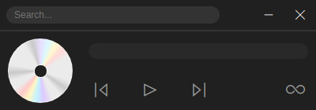
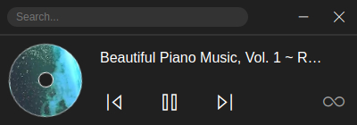

    

<h1 align="center">Youfy</h1>

 

**Youfy** is a cross-platform desktop application developed in JavaScript. It allows users to listen to the YouTube audio without video and has an autoplay feature with minimal audio controllers.

#### User Interface

 &nbsp; 

### Downloads

#### Linux

- [Download latest (x64)](https://github.com/saw-jan/youfy/releases/latest/download/youfy_linux_amd64.deb)

  Installation:

  1.  Make executable: `sudo chmod +x ./youfy_linux_x.deb`
  2.  Install: `sudo apt install ./youfy_linux_x.deb`

#### Windows

- Coming soon
